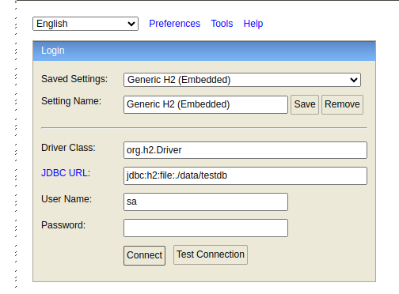
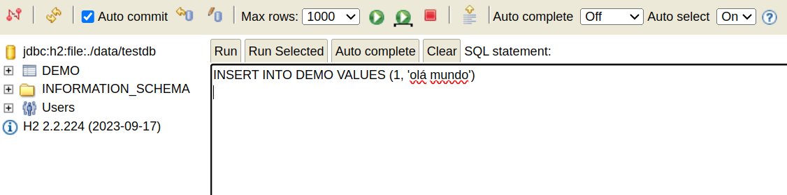
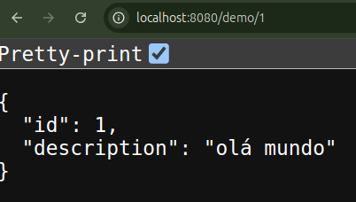

# H2 Database 🌿

Este projeto é uma API simples desenvolvida com Spring Boot. A aplicação utiliza JPA (Java Persistence API) para realizar operações de leitura em uma entidade chamada `Demo`.
 
## ✨ Manual

### 1. Executar o projeto 
Utilizando o Gradle, execute o seguinte comando:

```
./gradlew bootRun
```

### 2. Acessar o console do H2 

Acesse o console do banco de dados H2 para gerenciar e visualizar os dados:

```
localhost:8080/h2-console
```



### 3. Adicionar um registro 
Para inserir um novo registro no banco de dados, execute o comando SQL abaixo no console H2:

```
INSERT INTO DEMO VALUES (1, 'olá mundo')
```



### 4. Consultar registro cria
Consultar o registro feito:

```
localhost:8080/demo/1
```

 


## 📕 Tecnologias Utilizadas

- [Java 17](https://docs.oracle.com/en/java/javase/17/)
- [Spring Boot 3.3.4](https://docs.spring.io/spring-boot/index.html)
- [Spring Web Services](https://spring.io/projects/spring-ws)
- [Spring Data JPA](https://docs.spring.io/spring-data/jpa/reference/index.html)
- [H2 Database](https://www.h2database.com/html/main.html)
- [Gradle](https://docs.gradle.org/current/userguide/userguide.html)
 
## 📚 Estrutura do Projeto

O projeto é composto por quatro componentes principais:

1. **Entidade `Demo`**:
   - Representa um objeto com dois atributos: `id` e `description`. 
   - Torna possível o mapeamento do mundo real para uma tabela do banco ao utilizar JPA.

2. **Repositório `DemoRepository`**:
   - Fornece métodos para operações básicas com o banco de dados, como salvar, buscar, atualizar e deletar itens.
   - Faz parte da **camada de persistência** (repositórios), responsável por interagir diretamente com o banco de dados.

3. **Serviço `DemoService`**:
   - Serviço que encapsula a lógica de negócios. Contém o método `getDemo(Long id)` para buscar uma entidade `Demo` pelo ID.
   - Pertence à **camada de negócios** (serviços), que implementa a lógica e as regras do sistema.

4. **Controlador `DemoController`**:
   - Exposição do endpoint `/demo/{id}`, que permite buscar uma entidade `Demo` pelo identificador.
   - Faz parte da **camada de apresentação** (controladores), que é responsável por lidar com as requisições HTTP e interagir com os serviços.

## 📜 Licença

Este projeto está licenciado sob a licença MIT.
