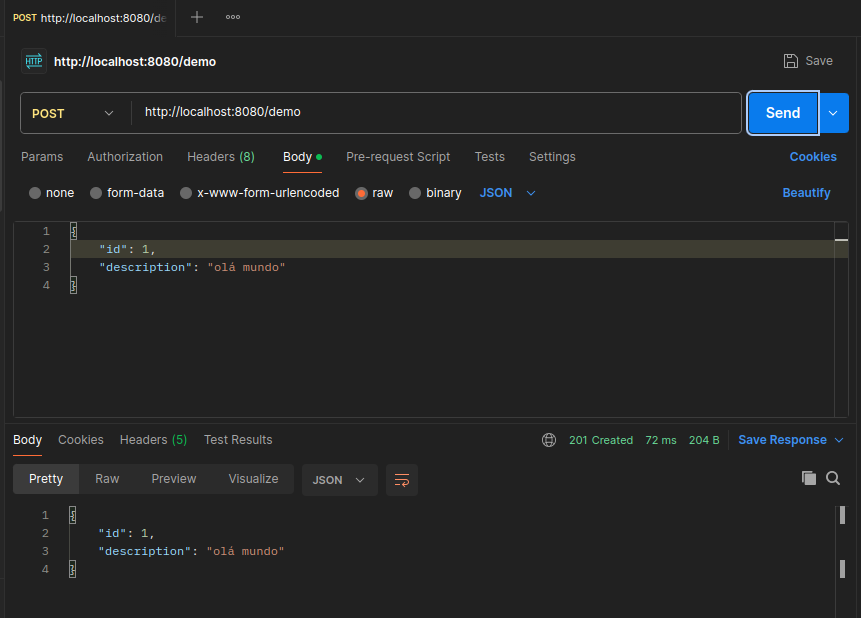
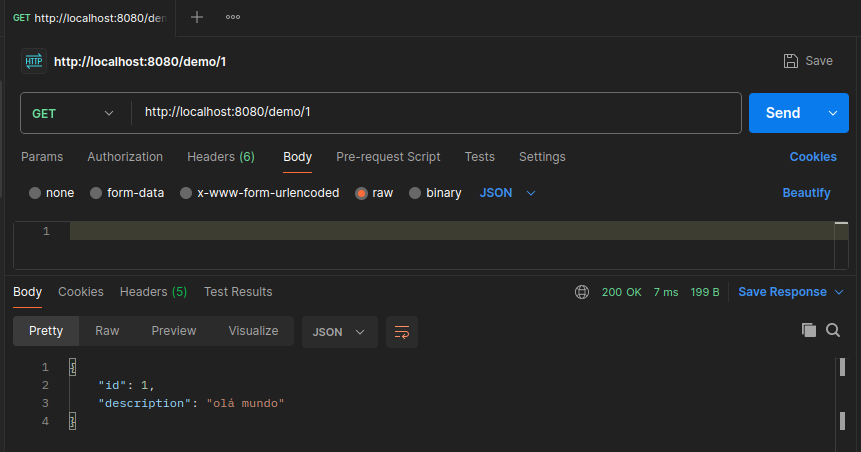

# Persistent Memory 🌿

Este projeto é uma aplicação básica construída com **Spring Boot**, que expõe uma API para realizar operações CRUD (Create, Read, Update, Delete) em uma entidade chamada `Demo`. Todos os dados são armazenados temporariamente em memória usando um `HashMap`.

## ✨ Manual
Utilizando o Gradle, execute o seguinte comando:

```
./gradlew bootRun
```

## 🎯 Objetivos

- [x] Montar uma aplicação básica em Spring Boot
- [x] Entender arquitetura Spring em serviços web
- [x] Operações CRUD  
- [x] Realizar teste da API com Postman

## ✨ Funcionalidades

A aplicação oferece os seguintes endpoints para interagir com a entidade `Demo`:

- **POST** `/demo` - Adiciona um novo registro.
- **GET** `/demo/{id}` - Consulta um registro pelo ID.
- **PUT** `/demo/{id}` - Atualiza um registro existente.
- **DELETE** `/demo/{id}` - Exclui um registro pelo ID.

## 📙 Postman  

O Postman é uma ferramenta para auxiliar teste de APIs. Permite enviar requisições HTTP para endpoints de APOs e ver diretamente as respostas. 

Uma pequena demonstração com o Postman:

###  **Adicionar um Registro**
- **POST** ```http://localhost:8080/demo```




###  **Consultar um Registro**
- **GET** ```http://localhost:8080/demo/1```



## 📕 Tecnologias Utilizadas

- [Java 17](https://docs.oracle.com/en/java/javase/17/)
- [Spring Boot 3.3.4](https://docs.spring.io/spring-boot/index.html)
- [Spring Web Services](https://spring.io/projects/spring-ws)
- [Gradle](https://docs.gradle.org/current/userguide/userguide.html)
 


## 📜 Licença

Este projeto está licenciado sob a licença MIT.
