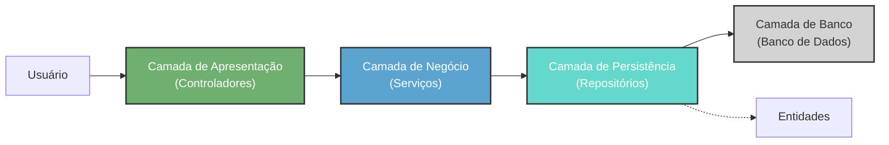

# Arquitetura do Spring Boot para Web Services

- Spring Boot é um framework que ajuda a criar serviços backend, os web services.

## 1) Camada de Apresentação - Controladores (Controllers)
- Trata de requisições e respostas, um proxy. 
- Não tem regras de negócio.
- "Um mapa com rotas"
- Alguns módulos para implementar essa camada: `spring-webmvc` e `Spring WebFlux`

## 2) Camada de Negócio - Serviços (Service)
- Onde se implementa a regra de negócios.
- Ideia do serviço é não identificar nenhuma tecnologia, apenas a regra de negócios.
- Sem dependências!
- Caso precise trocar de tecnologia, altera somente a camada de controladores e não a serviços.

## 3) Camada de Persistência - Repositórios (Repositories)
- Uma forma por baixo dos panos para criar as queries: Mapeamento objeto-relacional. Mapeamento do mundo real para tabela no banco. Essa camada faz o "DE - PARA", ORM. Entidade como alvo da consulta
- `Spring Data`, trabalho com repositório sem escrever um código SQL.

## 4) Camada de Banco - Banco de Dados (Database)
- Drivers
- Forma bloqueante ou forma reativa

---

# Referências
 
- https://www.youtube.com/watch?v=4g9EmpSBOYI&list=PLiFLtuN04BS0ENOAIL2NiqNNV0FmUKZH-&index=2
- https://wiki-coatic.saude.gov.br/backend-java 